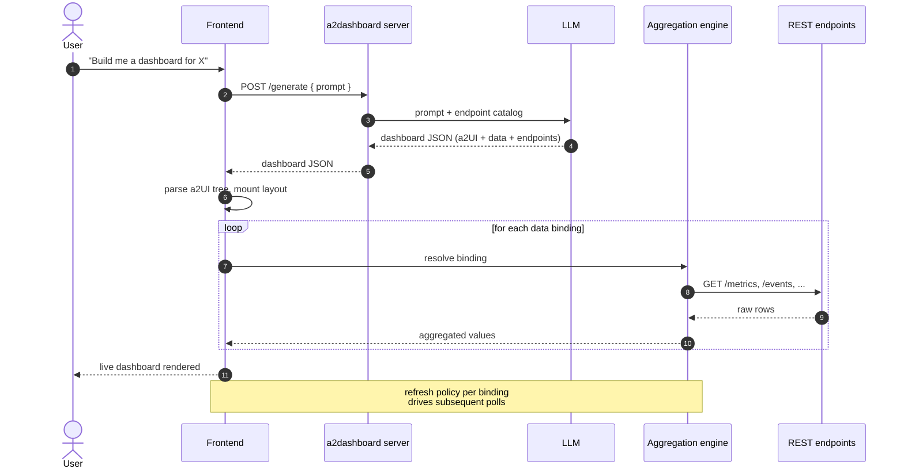
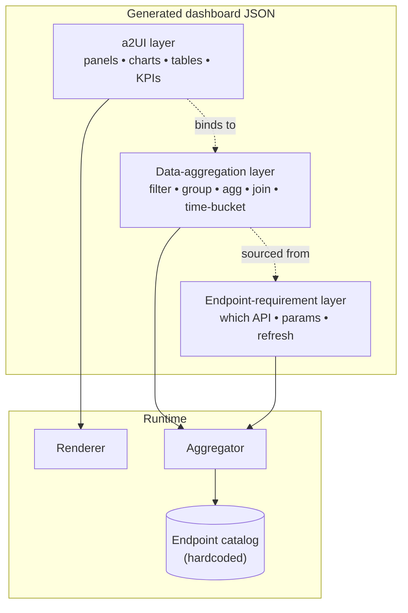

# a2dashboard

> Generic agentic dashboard server. Plug in any REST API, prompt an LLM, get a live declarative-JSON dashboard rendered as native UI. Adds data-binding and refresh primitives. Domain-agnostic.

## What it does

`a2dashboard` turns a plain-language description into a **working dashboard at runtime**, without anyone writing UI code.

1. The user describes the dashboard they want ("show me daily active users over the last 30 days, plus the top 5 endpoints by error rate").
2. An LLM picks the right endpoints from a hardcoded catalog of REST APIs, decides how the data should be aggregated, and emits a single JSON document.
3. The frontend interprets that JSON as a UI tree, fetches and aggregates the referenced data, and renders the live dashboard immediately.

No code generation, no build step, no deploy. The JSON *is* the dashboard.

## Demos

### Next.js — open issues


A single `table` bound to `/repos/vercel/next.js/issues`, refined turn-by-turn from the chat panel — each follow-up patches the existing spec instead of regenerating it.

### Open issues — React / Angular / Vue


A `row` of three `table` nodes, each bound to `/repos/{owner}/{repo}/issues` for one of the major JS frameworks — generated from a single prompt and rendered live against the GitHub REST API.

## The JSON format

The generated document is layered, so each concern stays separable and the LLM can be steered one piece at a time:

- **a2UI** — a declarative UI tree (panels, charts, tables, KPIs, layout). Renderer-agnostic.
- **Data-aggregation extension** — bindings that describe *how* fields are derived from endpoint responses (filter, group, aggregate, join, time-bucket).
- **Endpoint-requirement extension** — for every binding, which endpoint(s) it depends on, query parameters, and refresh policy.

```jsonc
{
  "ui": { /* a2UI tree: panels, charts, tables, KPIs */ },
  "data": { /* aggregations: filter / group / agg / join */ },
  "endpoints": { /* which REST APIs feed which bindings */ }
}
```

Because the data and endpoint layers are extensions on top of a2UI, the same UI tree can be re-pointed at different data sources without touching the layout.

## High-level architecture


## Runtime sequence

What happens when a user submits a prompt:



## Spec layers in one picture

How the three layers of the JSON spec relate to what the user sees:



## Why declarative JSON, not generated code?

Two reasonable shapes for an LLM-driven dashboard tool: have the model
emit a **declarative spec** (our approach) or have it **generate code**
(a React file, say) that you build and serve. The trade-offs run in
opposite directions; here is the honest comparison.

### Our approach — LLM emits a declarative JSON spec

The model writes a small JSON document against a fixed vocabulary. The
renderer executes only that vocabulary at runtime.

**Pros**

- **Safe by construction.** No arbitrary code crosses the LLM→client
  boundary. The renderer only invokes a registered set of primitives.
  No eval, no dynamic import, no sandbox to maintain.
- **Iterable.** The LLM patches the existing spec instead of
  regenerating it. IDs survive turns (`uiRootId`, component IDs,
  column IDs, binding IDs), so the user's mental model — "the stars
  column," "the issues tab" — stays attached to the same object across
  refinements.
- **Inspectable.** Flip to the JSON view and trace every panel back to
  a binding back to a catalogued endpoint. Failures localize: a 404 or
  a missing `field` is a one-line problem.
- **Bounded surface area.** Adding a capability means adding a
  primitive. The renderer is small, finite, and reviewable.
- **No build step at runtime.** One LLM round-trip returns ~1 KB of
  JSON; the renderer mounts immediately.
- **Layered, so the LLM can be steered piece by piece.** UI,
  aggregation, and endpoint are separable. Re-pointing the same UI tree
  at a different data source is a one-layer edit.
- **Portable.** The same JSON can be rendered by any client that
  implements the vocabulary — Angular, Lit, native — exactly the bet
  a2ui is making.
- **Cheap to validate.** OpenAI strict-mode JSON Schema rejects
  malformed output before it reaches the renderer.

**Cons**

- **Capped expressiveness.** Anything not in the vocabulary doesn't
  exist; the model must refuse rather than improvise.
- **More upfront work per capability.** Every new primitive is type
  + LLM-schema branch + resolver branch + React component + prompt
  copy + docs.
- **Spec drift risk.** Spec docs, JSON Schema, and renderer registry
  must stay in lockstep — enforced by convention, not the compiler.
- **Awkward for highly bespoke UIs.** Dashboards fit naturally; a
  freeform creative tool would chafe.

### The generated-code alternative

The LLM emits a React (or framework-of-choice) file; the system builds
and serves it.

**Pros**

- **Unlimited expressiveness.** Anything React can express, the LLM can
  request.
- **No infrastructure to design.** No spec schema, no resolver, no
  registry — just a sandbox that runs whatever the model wrote.

**Cons**

- **Unbounded threat model.** Arbitrary code in the browser means
  arbitrary fetches, storage access, script execution. Sandboxing is a
  permanent operating cost.
- **Patches are rewrites.** The model has no stable handle on "the
  stars column." A small change usually regenerates the whole file,
  breaking scroll position, local state, and any user customizations.
- **Hallucinates capabilities.** Without a typed vocabulary, the model
  invents endpoints, library APIs, and prop shapes. Errors surface as
  runtime crashes or — worse — silently-wrong data.
- **Build/deploy in the loop.** Every iteration needs compile + bundle
  + serve, which adds latency and failure modes.
- **Hard to inspect.** Tracing "where did this number come from"
  through generated React + ad-hoc fetch code is much harder than
  reading 30 lines of JSON.
- **Mixed concerns.** UI, data fetching, and transformation co-locate.
  Re-pointing the dashboard at a different API means re-prompting the
  whole file.
- **Cost scales with size.** Generated React for a real dashboard is
  tens of KB of output tokens. Our specs are ~1 KB.

### Why ours is the right call for this product

It comes down to what we're actually building: **dashboards that users
iterate on conversationally over a small set of catalogued data
sources.** Against that goal:

1. **Iteration is the loop, not the demo.** A dashboard's value emerges
   over several turns of refinement. Stable IDs and patch-not-rewrite
   semantics make that loop work; regenerated code doesn't.
2. **Safety isn't a feature we can defer.** The product runs LLM output
   in the user's browser. Declarative JSON makes the "arbitrary code
   execution" question disappear; generated code makes it a permanent
   operating cost.
3. **The vocabulary cap is the right cap.** We *want* the model to
   refuse a Sankey diagram rather than fake one — refusal is the honest
   signal that the product can't do something yet. Generated code
   rewards "fake it 'till you make it," which corrodes user trust.
4. **The three-layer model is only buyable with a spec.** Separating
   UI from data from endpoints is what lets us swap GitHub for any
   OpenAPI-described service later. Generated code conflates them and
   forecloses that path.
5. **Auditability scales with users.** When ten users hit a bug,
   "show me the spec" is one screen of JSON. "Show me the generated
   file" is ten different rewrites of the same dashboard.

The trade-off we accept is real: the model can only emit what we
taught it. But that ceiling moves up by one primitive per release, and
every primitive comes with a renderer, a schema branch, and prompt
copy — all reviewable, finite, finished work. Generated code's
"infinite ceiling" is mostly an illusion; the floor is much lower than
ours and the operating cost much higher.

## Supported components

The renderer ships ten UI primitives. The LLM is told about exactly
these — any request that would require a primitive not listed here is
refused with a textual reply, rather than faked. Vocabulary is borrowed
from Google's a2ui basic catalog so a spec written against this
renderer reads sensibly against any other a2ui-compatible one.

Every component has a stable `id` (preserved across patches) and an
optional `title`. The fields below are in addition to those.

### Data

| Component | What it is | Key fields |
|---|---|---|
| `table` | Renders rows from a binding. Each column is either a raw `field` path or a nested `cell` UI node; cell subtrees see the current row via a React context, so a `text` leaf inside a cell can `field`-bind against it. | `rows` (binding id), `columns[]` of `{ id, header, field?, cell? }` |

### Layout containers (flex)

| Component | What it is | Key fields |
|---|---|---|
| `row` | Horizontal flex container — children laid out left-to-right. | `children[]`, `justify`, `align` |
| `column` | Vertical flex container — children laid out top-to-bottom. | `children[]`, `justify`, `align` |
| `list` | Uniform flex container with a configurable axis. Horizontal lists scroll along the x-axis; vertical lists stack. | `children[]`, `direction`, `align` |

`justify` ∈ `start` · `center` · `end` · `spaceBetween` · `spaceAround` · `spaceEvenly`.
`align`   ∈ `start` · `center` · `end` · `stretch`.
`direction` ∈ `vertical` · `horizontal`.

### Grouping containers

| Component | What it is | Key fields |
|---|---|---|
| `card` | Bordered, elevated single-child wrapper with an optional heading. To put multiple things in a card, point `child` at a `row`/`column`/`list`. | `child` |
| `tabs` | Tabbed switcher between several titled child views. The first tab is active on mount; only the active panel is mounted, so an inactive tab won't fetch. | `tabs: [{ title, child }]` |

### Display leaves

| Component | What it is | Key fields |
|---|---|---|
| `text` | Plain text with a typography hint, mapped onto MUI's `Typography`. When placed inside a table cell, `field` reads from the row instead of the literal `text`. | `text` *or* `field`, `variant` |
| `icon` | A named glyph from a curated enum, mapped onto `@mui/icons-material`. | `name` |

`variant` ∈ `h1` · `h2` · `h3` · `h4` · `h5` · `caption` · `body`.

`name` ∈ `accountCircle` · `add` · `arrowBack` · `arrowForward` ·
`calendarToday` · `check` · `close` · `delete` · `download` · `edit` ·
`error` · `favorite` · `folder` · `help` · `home` · `info` · `lock` ·
`lockOpen` · `mail` · `menu` · `person` · `refresh` · `search` · `send` ·
`settings` · `share` · `star` · `upload` · `visibility` ·
`visibilityOff` · `warning`.

### Interactive leaves

Inspired by a2ui's basic-catalog `Button` and `TextField`. These are
the only primitives in the MVP that produce client-side state — and
even then no arbitrary code crosses the LLM→client boundary. `button`
dispatches one of a fixed enum of declared actions; `textField` writes
to a named state slot that endpoint params can consume.

| Component | What it is | Key fields |
|---|---|---|
| `textField` | Labeled text input wired into the dashboard's shared state map. The user-typed value flows into the slot named by `stateKey`; endpoint params declared as `{ stateKey: "<same key>" }` pick it up on the next refresh. `defaultValue` seeds the slot on mount so the dashboard renders something before the user types. Typing alone does **not** refetch — pair with a `button` for the explicit "go". | `label`, `stateKey`, `defaultValue?`, `placeholder?`, `variant` |
| `button` | Clickable wrapper around a single child node (typically `text` for a labeled button, or `icon` for an icon-only one). Dispatches one of a fixed enum of declared `action`s — never arbitrary code. The MVP action `{ kind: "refresh" }` bumps a shared refresh tick, re-firing every binding using the current state values. New actions land as new spec variants, not as a code escape hatch. | `child`, `variant`, `action` |

`textField variant` ∈ `shortText` · `longText` · `number` · `obscured`.
`button variant` ∈ `default` · `primary` · `borderless`.
`button action` ∈ `{ "kind": "refresh" }`.

#### State-bound endpoint params

Endpoint params accept either a literal scalar or a `{ stateKey }`
reference. The reference resolves at fetch time against the matching
`textField`'s current value:

```jsonc
{
  "ui": {
    "type": "column",
    "id": "root",
    "children": [
      { "type": "textField", "id": "user_input", "label": "GitHub user",
        "stateKey": "username", "defaultValue": "octocat", "variant": "shortText" },
      { "type": "button", "id": "go",
        "child": { "type": "text", "id": "go_label", "text": "Show repos" },
        "variant": "primary", "action": { "kind": "refresh" } },
      { "type": "table", "id": "repos", "rows": "repos_binding",
        "columns": [
          { "id": "name",  "header": "Repo",  "field": "full_name" },
          { "id": "stars", "header": "Stars", "field": "stargazers_count" }
        ]
      }
    ]
  },
  "data": {
    "repos_binding": { "type": "rows", "endpoint": "repos_call" }
  },
  "endpoints": {
    "repos_call": {
      "endpointId": "github.userRepos",
      "params": { "username": { "stateKey": "username" } },
      "refresh": { "kind": "on-mount" }
    }
  }
}
```

The dashboard renders on mount with `username=octocat`; typing into the
field updates the slot; clicking the button bumps the refresh tick and
the table reloads against the new value. No keystroke fetches the
network on its own — the button is the explicit "go".

## Bindings

The `data` map holds the bindings that produce rows for tables. Each
binding is a typed primitive — never a free-form expression — so the
renderer's evaluator stays finite and reviewable. New operators (group
/ aggregate / join / time-bucket) land as new variants.

| Binding | What it produces | Key fields |
|---|---|---|
| `rows` | Raw rows from a catalogued endpoint. The response is treated as the row array, or descended via `rowsPath` when it isn't already an array. | `endpoint` (endpoint entry id), `rowsPath?` |
| `filter` | Rows from another binding, keeping only those whose `field` matches `value`. Chains: a filter's `source` can itself be another filter. Evaluated inside the same hook as the data fetch, so it re-runs on `button`-triggered refresh — typing alone does NOT re-filter. | `source` (id of another binding), `field` (dotted path), `op`, `value` (literal or `{ stateKey }`) |

`filter op` ∈ `containsIgnoreCase`. Case-insensitive substring match
against `String(row[field])`. An empty `value` (e.g. an unfilled
search `textField`) matches every row, so the table shows everything
on mount when the search field has no `defaultValue`.

### Worked example: search issues in a repo

The user's "search input + Apply button + table of React issues"
dashboard ties together all the moving parts — a `textField` for the
query, a `button` whose `refresh` action both re-fetches and
re-evaluates the filter, a `rows` binding that pulls every open issue
from `facebook/react`, and a `filter` binding that narrows them by
title:

```jsonc
{
  "ui": {
    "type": "column",
    "id": "root",
    "children": [
      { "type": "textField", "id": "search_input", "label": "Search issues",
        "stateKey": "issue_query", "placeholder": "e.g. hydration",
        "variant": "shortText" },
      { "type": "button", "id": "apply",
        "child": { "type": "text", "id": "apply_label", "text": "Apply" },
        "variant": "primary", "action": { "kind": "refresh" } },
      { "type": "table", "id": "issues", "rows": "filtered_issues",
        "columns": [
          { "id": "number", "header": "#",      "field": "number" },
          { "id": "title",  "header": "Title",  "field": "title" },
          { "id": "user",   "header": "Author", "field": "user.login" },
          { "id": "comments", "header": "Comments", "field": "comments" }
        ]
      }
    ]
  },
  "data": {
    "all_react_issues": { "type": "rows", "endpoint": "react_issues_call" },
    "filtered_issues":  {
      "type": "filter",
      "source": "all_react_issues",
      "field":  "title",
      "op":     "containsIgnoreCase",
      "value":  { "stateKey": "issue_query" }
    }
  },
  "endpoints": {
    "react_issues_call": {
      "endpointId": "github.repoIssues",
      "params": {
        "owner":    "facebook",
        "repo":     "react",
        "state":    "open",
        "per_page": 100
      },
      "refresh": { "kind": "on-mount" }
    }
  }
}
```

On mount the table shows every open `facebook/react` issue (empty
search ⇒ filter is a no-op). The user types `hydration`, clicks
**Apply**, and the table refetches and re-narrows to issues whose
title matches "hydration" (case-insensitive). Clear the field and
press **Apply** again to see everything.

## Supported data sources

The endpoint catalog is hardcoded in `server/src/catalog/github.ts`
and serves two GitHub REST endpoints under `https://api.github.com`.
Requests can be unauthenticated for public data (60 req/hour) or
authenticated with a GitHub Personal Access Token via
`Authorization: Bearer <token>` (5000 req/hour).

A future iteration will accept user-registered APIs (OpenAPI ingest)
per tenant; the catalog interface is kept narrow on purpose so that
swap stays cheap.

### `github.userRepos` — list a user's repositories

`GET https://api.github.com/users/{username}/repos`

Paginated list of a user's public repositories.

| Param | In | Required | Notes |
|---|---|---|---|
| `username` | path | yes | GitHub username. |
| `type` | query | no | `all` · `owner` · `member` |
| `sort` | query | no | `created` · `updated` · `pushed` · `full_name` |
| `direction` | query | no | `asc` · `desc` |
| `page` | query | no | Page number (1-based). |
| `per_page` | query | no | Results per page (max 100). |

Row fields commonly used in column bindings: `name`, `full_name`,
`html_url`, `description`, `stargazers_count`, `forks_count`,
`open_issues_count`, `language`, `updated_at`, `owner.login`.

### `github.repoIssues` — list issues for a repository

`GET https://api.github.com/repos/{owner}/{repo}/issues`

Paginated list of issues for a repository.

| Param | In | Required | Notes |
|---|---|---|---|
| `owner` | path | yes | Repository owner (user or org). |
| `repo` | path | yes | Repository name. |
| `state` | query | no | `open` · `closed` · `all` |
| `labels` | query | no | Comma-separated label names. |
| `sort` | query | no | `created` · `updated` · `comments` |
| `direction` | query | no | `asc` · `desc` |
| `since` | query | no | ISO 8601 timestamp. |
| `page` | query | no | Page number (1-based). |
| `per_page` | query | no | Results per page (max 100). |

Row fields commonly used in column bindings: `number`, `title`,
`state`, `html_url`, `user.login`, `comments`, `created_at`,
`updated_at`.

## MVP scope

The current implementation is deliberately narrow — just enough surface area to validate the three-layer model end-to-end. Everything else (charts, KPIs, aggregations, more endpoints, alternative renderers) lands as a named extension to this MVP, not by quietly widening it.

- **UI:** the ten primitives listed under [Supported components](#supported-components). Rendered with React + MUI.
- **Aggregation:** the two bindings listed under [Bindings](#bindings) — `rows` for raw endpoint responses and `filter` (op `containsIgnoreCase`) for client-side text filtering. No `group` / `agg` / `join` / `time-bucket` yet.
- **Endpoint catalog:** the two GitHub endpoints listed under [Supported data sources](#supported-data-sources). Pagination is the only data-side behavior; refresh policy is `on-mount` or `manual`. Endpoint param values may also be `{ stateKey }` references that resolve against `textField` slots at fetch time, making a button-driven "type → search" dashboard expressible without any code escape hatch.

In practice, a small MVP dashboard JSON is a single `table` bound to one of the catalogued endpoints; a richer one composes several tables under a `row`, `column`, `tabs`, or `card`; an interactive one adds a `textField` + `button` row whose state feeds either an endpoint param (refetch on apply) or a `filter` binding (re-narrow on apply).

## Milestones

`a2dashboard` is built up one tagged milestone at a time. Each tag is a self-contained slice of the three-layer model (UI + aggregation + endpoint) — narrow on purpose, so the loop can be exercised end-to-end before the surface area widens.

| Version | Date | Theme | Highlights |
|---|---|---|---|
| **[v0.0.2](https://github.com/frb-eng/a2dashboard/releases/tag/v0.0.2)** | 2026-05-19 | Composable, interactive dashboards | Ten a2ui-aligned UI primitives (layout containers, grouping containers, display + interactive leaves) · recursive table cells (any UI node inside any cell) · first aggregation primitive (`filter` op `containsIgnoreCase`) · shared client-side state map driven by `textField`, applied by `button` action `refresh` · LLM emits flat `componentEntries[]` + `uiRootId`, server resolves into the renderer-friendly tree with cycle checks |
| **[v0.0.1](https://github.com/frb-eng/a2dashboard/releases/tag/v0.0.1)** | 2026-05-18 | Conversational, multi-session iteration | Chat-based iteration that patches (not rewrites) the spec, preserving ids · multiple parallel dashboards switchable from a sidebar, persisted to `localStorage` · assistant can reply textually when a request is ambiguous or needs primitives/endpoints that don't exist yet |

### What v0.0.2 delivers

A user can now describe a *composable, interactive* dashboard — multi-panel layouts, tabs, cards, free-text search with an Apply button — and watch it render live against the GitHub REST API. The renderer's vocabulary grew from one primitive to ten, the data layer gained its first aggregation operator, and dashboards stopped being read-only.

- Ten UI primitives, all aligned with Google's a2ui basic catalog: `table`, `row` / `column` / `list` (layout), `card` / `tabs` (grouping), `text` / `icon` (display leaves), and `textField` / `button` (interactive leaves).
- Recursive table cells: every `TableColumn` carries either a `field` path or a nested `cell` UI node, so any subtree — including icon-plus-bound-text or stacked-line cells — can live inside any cell. Cell subtrees resolve `field` against the row through a React context.
- First aggregation primitive — `filter` (op `containsIgnoreCase`). Filters chain through `source`, accept literal or `{ stateKey }` values, and are evaluated inside `useRows` so they re-apply on button-triggered refresh.
- Shared client-side state map driven by `textField` (writes a slot named by `stateKey`) and consumed by endpoint params and filter bindings declared as `{ stateKey }`. `button` action `refresh` bumps a shared tick and re-fires every binding against the current state — typing alone does NOT refetch.
- Flat-components intermediate: the LLM emits `componentEntries[]` + `uiRootId` (children referenced by `childIds`, `childId`, `tabs[].childId`, column `cellId`); the server resolves the flat form into the renderer-friendly tree with cycle and dangling-reference checks. Sidesteps OpenAI strict mode's recursive-schema limits.

### What v0.0.1 delivers

A user can describe a dashboard in plain language and get a live table populated from GitHub's REST API — no code generation, no build step, no deploy — then iterate on it turn-by-turn and keep several dashboards going in parallel.

- Declarative JSON spec (a2UI tree + data bindings + endpoint requirements) generated by `gpt-5-mini` with strict structured outputs.
- React + MUI renderer that interprets the spec at runtime. MVP primitive: `table`. Two GitHub endpoints (`/users/{u}/repos`, `/repos/{o}/{r}/issues`) with pagination params and manual / on-mount refresh.
- Multi-turn chat that patches the existing JSON rather than rewriting it; ui node, column, and binding ids are preserved across turns so the user's mental model survives iteration.
- Multiple parallel dashboard sessions, each with its own conversation, switchable from a left sidebar and persisted to `localStorage`.
- Graceful textual replies when a request is ambiguous, off-topic, or needs primitives or endpoints not yet supported — instead of inventing capabilities to "make it work".

## Status

Early prototype. The endpoint catalog is currently hardcoded — a future iteration will let users register their own REST APIs (OpenAPI ingest) so the catalog becomes per-tenant.
