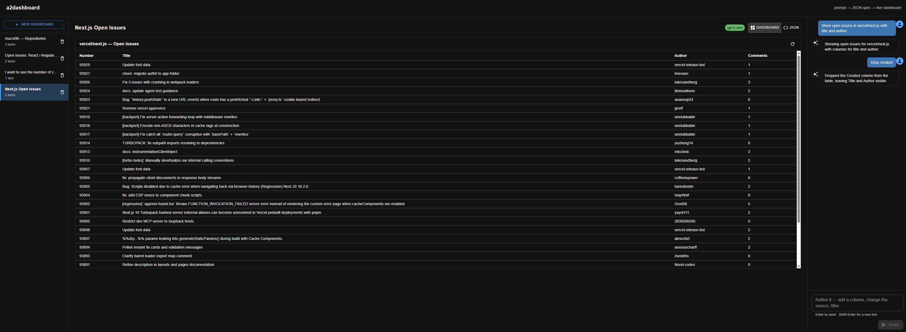
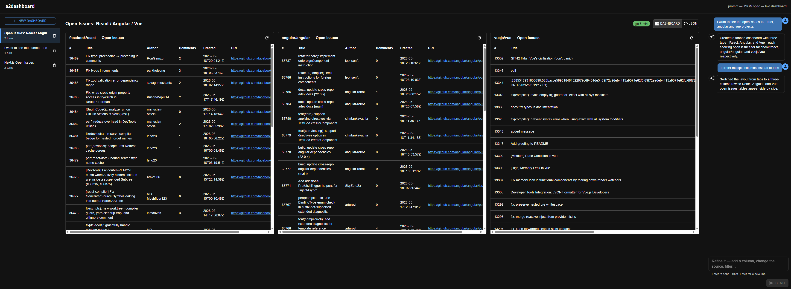
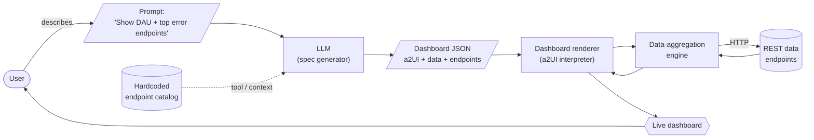
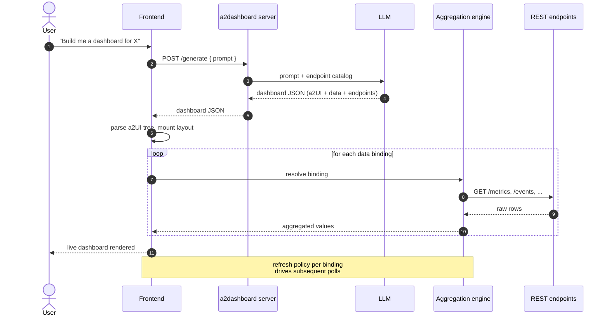
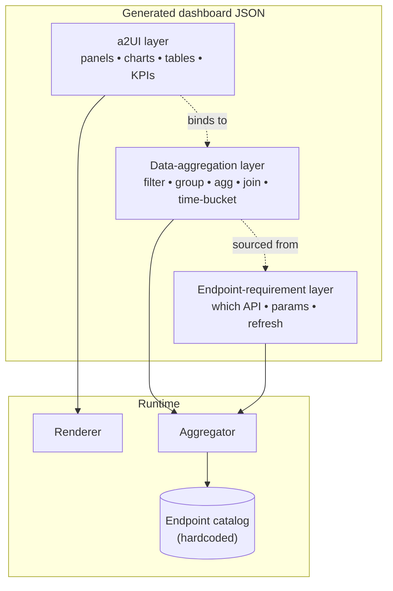

# a2dashboard

> Generic agentic dashboard server. Plug in any REST API, prompt an LLM, get a live declarative-JSON dashboard rendered as native UI. Adds data-binding and refresh primitives. Domain-agnostic.

## What it does

`a2dashboard` turns a plain-language description into a **working dashboard at runtime**, without anyone writing UI code.

1. The user describes the dashboard they want ("show me daily active users over the last 30 days, plus the top 5 endpoints by error rate").
2. An LLM picks the right endpoints from a hardcoded catalog of REST APIs, decides how the data should be aggregated, and emits a single JSON document.
3. The frontend interprets that JSON as a UI tree, fetches and aggregates the referenced data, and renders the live dashboard immediately.

No code generation, no build step, no deploy. The JSON *is* the dashboard.

## Demos

### Next.js — open issues



A single `table` bound to `/repos/vercel/next.js/issues`, refined turn-by-turn from the chat panel — each follow-up patches the existing spec instead of regenerating it.

### Open issues — React / Angular / Vue



A `row` of three `table` nodes, each bound to `/repos/{owner}/{repo}/issues` for one of the major JS frameworks — generated from a single prompt and rendered live against the GitHub REST API.

## The JSON format

The generated document is layered, so each concern stays separable and the LLM can be steered one piece at a time:

- **a2UI** — a declarative UI tree (panels, charts, tables, KPIs, layout). Renderer-agnostic.
- **Data-aggregation extension** — bindings that describe *how* fields are derived from endpoint responses (filter, group, aggregate, join, time-bucket).
- **Endpoint-requirement extension** — for every binding, which endpoint(s) it depends on, query parameters, and refresh policy.

```jsonc
{
  "ui": { /* a2UI tree: panels, charts, tables, KPIs */ },
  "data": { /* aggregations: filter / group / agg / join */ },
  "endpoints": { /* which REST APIs feed which bindings */ }
}
```

Because the data and endpoint layers are extensions on top of a2UI, the same UI tree can be re-pointed at different data sources without touching the layout.

## High-level architecture



## Runtime sequence

What happens when a user submits a prompt:



## Spec layers in one picture

How the three layers of the JSON spec relate to what the user sees:



## Why declarative JSON, not generated code?

Two reasonable shapes for an LLM-driven dashboard tool: have the model
emit a **declarative spec** (our approach) or have it **generate code**
(a React file, say) that you build and serve. The trade-offs run in
opposite directions; here is the honest comparison.

### Our approach — LLM emits a declarative JSON spec

The model writes a small JSON document against a fixed vocabulary. The
renderer executes only that vocabulary at runtime.

**Pros**

- **Safe by construction.** No arbitrary code crosses the LLM→client
  boundary. The renderer only invokes a registered set of primitives.
  No eval, no dynamic import, no sandbox to maintain.
- **Iterable.** The LLM patches the existing spec instead of
  regenerating it. IDs survive turns (`uiRootId`, component IDs,
  column IDs, binding IDs), so the user's mental model — "the stars
  column," "the issues tab" — stays attached to the same object across
  refinements.
- **Inspectable.** Flip to the JSON view and trace every panel back to
  a binding back to a catalogued endpoint. Failures localize: a 404 or
  a missing `field` is a one-line problem.
- **Bounded surface area.** Adding a capability means adding a
  primitive. The renderer is small, finite, and reviewable.
- **No build step at runtime.** One LLM round-trip returns ~1 KB of
  JSON; the renderer mounts immediately.
- **Layered, so the LLM can be steered piece by piece.** UI,
  aggregation, and endpoint are separable. Re-pointing the same UI tree
  at a different data source is a one-layer edit.
- **Portable.** The same JSON can be rendered by any client that
  implements the vocabulary — Angular, Lit, native — exactly the bet
  a2ui is making.
- **Cheap to validate.** OpenAI strict-mode JSON Schema rejects
  malformed output before it reaches the renderer.

**Cons**

- **Capped expressiveness.** Anything not in the vocabulary doesn't
  exist; the model must refuse rather than improvise.
- **More upfront work per capability.** Every new primitive is type
  + LLM-schema branch + resolver branch + React component + prompt
  copy + docs.
- **Spec drift risk.** Spec docs, JSON Schema, and renderer registry
  must stay in lockstep — enforced by convention, not the compiler.
- **Awkward for highly bespoke UIs.** Dashboards fit naturally; a
  freeform creative tool would chafe.

### The generated-code alternative

The LLM emits a React (or framework-of-choice) file; the system builds
and serves it.

**Pros**

- **Unlimited expressiveness.** Anything React can express, the LLM can
  request.
- **No infrastructure to design.** No spec schema, no resolver, no
  registry — just a sandbox that runs whatever the model wrote.

**Cons**

- **Unbounded threat model.** Arbitrary code in the browser means
  arbitrary fetches, storage access, script execution. Sandboxing is a
  permanent operating cost.
- **Patches are rewrites.** The model has no stable handle on "the
  stars column." A small change usually regenerates the whole file,
  breaking scroll position, local state, and any user customizations.
- **Hallucinates capabilities.** Without a typed vocabulary, the model
  invents endpoints, library APIs, and prop shapes. Errors surface as
  runtime crashes or — worse — silently-wrong data.
- **Build/deploy in the loop.** Every iteration needs compile + bundle
  + serve, which adds latency and failure modes.
- **Hard to inspect.** Tracing "where did this number come from"
  through generated React + ad-hoc fetch code is much harder than
  reading 30 lines of JSON.
- **Mixed concerns.** UI, data fetching, and transformation co-locate.
  Re-pointing the dashboard at a different API means re-prompting the
  whole file.
- **Cost scales with size.** Generated React for a real dashboard is
  tens of KB of output tokens. Our specs are ~1 KB.

### Why ours is the right call for this product

It comes down to what we're actually building: **dashboards that users
iterate on conversationally over a small set of catalogued data
sources.** Against that goal:

1. **Iteration is the loop, not the demo.** A dashboard's value emerges
   over several turns of refinement. Stable IDs and patch-not-rewrite
   semantics make that loop work; regenerated code doesn't.
2. **Safety isn't a feature we can defer.** The product runs LLM output
   in the user's browser. Declarative JSON makes the "arbitrary code
   execution" question disappear; generated code makes it a permanent
   operating cost.
3. **The vocabulary cap is the right cap.** We *want* the model to
   refuse a Sankey diagram rather than fake one — refusal is the honest
   signal that the product can't do something yet. Generated code
   rewards "fake it 'till you make it," which corrodes user trust.
4. **The three-layer model is only buyable with a spec.** Separating
   UI from data from endpoints is what lets us swap GitHub for any
   OpenAPI-described service later. Generated code conflates them and
   forecloses that path.
5. **Auditability scales with users.** When ten users hit a bug,
   "show me the spec" is one screen of JSON. "Show me the generated
   file" is ten different rewrites of the same dashboard.

The trade-off we accept is real: the model can only emit what we
taught it. But that ceiling moves up by one primitive per release, and
every primitive comes with a renderer, a schema branch, and prompt
copy — all reviewable, finite, finished work. Generated code's
"infinite ceiling" is mostly an illusion; the floor is much lower than
ours and the operating cost much higher.

## Supported components

The renderer ships eleven UI primitives. The LLM is told about exactly
these — any request that would require a primitive not listed here is
refused with a textual reply, rather than faked. Vocabulary is borrowed
from Google's a2ui basic catalog (`barChart` is the one chart-shaped
extension on top of that catalog) so a spec written against this
renderer reads sensibly against any other a2ui-compatible one.

Every component has a stable `id` (preserved across patches) and an
optional `title`. The fields below are in addition to those.

### Data

| Component | What it is | Key fields |
|---|---|---|
| `table` | Renders rows from a binding. Each column is either a raw `field` path or a nested `cell` UI node; cell subtrees see the current row via a React context, so a `text` leaf inside a cell can `field`-bind against it. An optional `onRowClick` action turns rows into a master-detail trigger — clicking a row dispatches the action with the clicked row in scope. | `rows` (binding id), `columns[]` of `{ id, header, field?, cell? }`, `onRowClick?` |
| `barChart` | Renders rows from a binding as a vertical bar chart. `categoryField` is a dotted path into each row used as the x-axis label; `valueField` is a dotted path used as the y-axis numeric value (non-numeric / missing values render as 0). When `seriesField` is set, rows are grouped by its value into multiple series rendered side-by-side per category, with a legend — the natural shape for comparing the same metric across several entities (e.g. three repos joined via a `union` binding, `seriesField` pointing at the union's `tagField`). Omit `seriesField` for a single-series chart. No transformation lives here — for "top N by X", pipe the binding through `sort` + `limit` the same way you would for a table. Rendered with Highcharts. | `rows` (binding id), `categoryField`, `valueField`, `seriesField?` |

### Layout containers (flex)

| Component | What it is | Key fields |
|---|---|---|
| `row` | Horizontal flex container — children laid out left-to-right. | `children[]`, `justify`, `align` |
| `column` | Vertical flex container — children laid out top-to-bottom. | `children[]`, `justify`, `align` |
| `list` | Uniform flex container with a configurable axis. Horizontal lists scroll along the x-axis; vertical lists stack. | `children[]`, `direction`, `align` |

`justify` ∈ `start` · `center` · `end` · `spaceBetween` · `spaceAround` · `spaceEvenly`.
`align`   ∈ `start` · `center` · `end` · `stretch`.
`direction` ∈ `vertical` · `horizontal`.

### Grouping containers

| Component | What it is | Key fields |
|---|---|---|
| `card` | Bordered, elevated single-child wrapper with an optional heading. To put multiple things in a card, point `child` at a `row`/`column`/`list`. | `child` |
| `tabs` | Tabbed switcher between several titled child views. The first tab is active on mount; only the active panel is mounted, so an inactive tab won't fetch. | `tabs: [{ title, child }]` |

### Display leaves

| Component | What it is | Key fields |
|---|---|---|
| `text` | Plain text with a typography hint, mapped onto MUI's `Typography`. When placed inside a table cell, `field` reads from the row instead of the literal `text`. | `text` *or* `field`, `variant` |
| `icon` | A named glyph from a curated enum, mapped onto `@mui/icons-material`. | `name` |

`variant` ∈ `h1` · `h2` · `h3` · `h4` · `h5` · `caption` · `body`.

`name` ∈ `accountCircle` · `add` · `arrowBack` · `arrowForward` ·
`calendarToday` · `check` · `close` · `delete` · `download` · `edit` ·
`error` · `favorite` · `folder` · `help` · `home` · `info` · `lock` ·
`lockOpen` · `mail` · `menu` · `person` · `refresh` · `search` · `send` ·
`settings` · `share` · `star` · `upload` · `visibility` ·
`visibilityOff` · `warning`.

### Interactive leaves

Inspired by a2ui's basic-catalog `Button` and `TextField`. These are
the only primitives in the MVP that produce client-side state — and
even then no arbitrary code crosses the LLM→client boundary. `button`
dispatches one of a fixed enum of declared actions; `textField` writes
to a named state slot that endpoint params can consume.

| Component | What it is | Key fields |
|---|---|---|
| `textField` | Labeled text input wired into the dashboard's shared state map. The user-typed value flows into the slot named by `stateKey`; endpoint params declared as `{ stateKey: "<same key>" }` pick it up on the next refresh. `defaultValue` seeds the slot on mount so the dashboard renders something before the user types. Typing alone does **not** refetch — pair with a `button` for the explicit "go". | `label`, `stateKey`, `defaultValue?`, `placeholder?`, `variant` |
| `button` | Clickable wrapper around a single child node (typically `text` for a labeled button, or `icon` for an icon-only one). Dispatches one of a fixed enum of declared `action`s — never arbitrary code. See **Actions** below. | `child`, `variant`, `action` |

`textField variant` ∈ `shortText` · `longText` · `number` · `obscured`.
`button variant` ∈ `default` · `primary` · `borderless`.

#### Actions

Both `button.action` and `table.onRowClick` carry an `Action`. The
renderer dispatches exactly one of the variants below — there is no
free-form code path.

| Action | What it does |
|---|---|
| `{ "kind": "refresh" }` | Bumps the dashboard's shared refresh tick; every binding refetches using the current state slot values. |
| `{ "kind": "setStateAndRefresh", "stateKey": "<slot>", "valueField": "<dotted path>" }` | Reads `valueField` from the row in scope, writes it into the named state slot, **then** bumps the refresh tick. The row in scope is the clicked row for `table.onRowClick`, the enclosing table cell's row for a `button` inside a cell, or empty otherwise (the slot gets `""`). This is the master-detail wiring — a row click on the left repopulates a slot that the right panel's endpoint param consumes. |

#### State-bound endpoint params

Endpoint params accept either a literal scalar or a `{ stateKey }`
reference. The reference resolves at fetch time against the matching
`textField`'s current value:

```jsonc
{
  "ui": {
    "type": "column",
    "id": "root",
    "children": [
      { "type": "textField", "id": "user_input", "label": "GitHub user",
        "stateKey": "username", "defaultValue": "octocat", "variant": "shortText" },
      { "type": "button", "id": "go",
        "child": { "type": "text", "id": "go_label", "text": "Show repos" },
        "variant": "primary", "action": { "kind": "refresh" } },
      { "type": "table", "id": "repos", "rows": "repos_binding",
        "columns": [
          { "id": "name",  "header": "Repo",  "field": "full_name" },
          { "id": "stars", "header": "Stars", "field": "stargazers_count" }
        ]
      }
    ]
  },
  "data": {
    "repos_binding": { "type": "rows", "endpoint": "repos_call" }
  },
  "endpoints": {
    "repos_call": {
      "endpointId": "github.userRepos",
      "params": { "username": { "stateKey": "username" } },
      "refresh": { "kind": "on-mount" }
    }
  }
}
```

The dashboard renders on mount with `username=octocat`; typing into the
field updates the slot; clicking the button bumps the refresh tick and
the table reloads against the new value. No keystroke fetches the
network on its own — the button is the explicit "go".

#### Master-detail with `table.onRowClick`

A row click can write into the shared state map and refresh in one
step, with no `textField` involved. The left table lists repositories;
clicking one writes its `name` into `selectedRepo`, which the right
table's contributors endpoint consumes as its `repo` path param:

```jsonc
{
  "ui": {
    "type": "row",
    "id": "root",
    "children": [
      { "type": "table", "id": "repos", "rows": "repos_binding",
        "columns": [
          { "id": "name",  "header": "Repository", "field": "name" },
          { "id": "stars", "header": "Stars",      "field": "stargazers_count" }
        ],
        "onRowClick": {
          "kind": "setStateAndRefresh",
          "stateKey": "selectedRepo",
          "valueField": "name"
        }
      },
      { "type": "table", "id": "contributors", "rows": "contributors_binding",
        "columns": [
          { "id": "login",  "header": "Contributor", "field": "login" },
          { "id": "commits","header": "Commits",     "field": "contributions" }
        ]
      }
    ]
  },
  "data": {
    "repos_binding":        { "type": "rows", "endpoint": "repos_call" },
    "contributors_binding": { "type": "rows", "endpoint": "contributors_call" }
  },
  "endpoints": {
    "repos_call": {
      "endpointId": "github.userRepos",
      "params": { "username": "anthropics" },
      "refresh": { "kind": "on-mount" }
    },
    "contributors_call": {
      "endpointId": "github.repoContributors",
      "params": { "owner": "anthropics", "repo": { "stateKey": "selectedRepo" } },
      "refresh": { "kind": "on-mount" }
    }
  }
}
```

On mount the left table shows every `anthropics` repository. The right
table sits idle ("Waiting for selectedRepo…") because its `repo` path
param is bound to a state slot that is empty on mount — the renderer
knows from the catalog that `repo` is required and holds the fetch
rather than throwing "missing path param". The moment the user clicks
a repository on the left, `selectedRepo` is written and the refresh
tick fires; the gate opens and the contributors table fetches against
the chosen repo. Clicking another repository repeats the cycle. The
spec carries no extra annotation — the catalog's `required` flag plus
"the param's value is a `{ stateKey }` whose slot is empty" is the
whole rule.

#### Bar chart bound to a row pipeline

`barChart` consumes a row binding the same way `table` does — point its
`rows` at any binding (raw or piped through `sort` + `limit`), pick the
two field paths, done. "Top 10 contributors to `facebook/react` as a
bar chart" needs no `sort` (the contributors endpoint is already
ordered by commit count desc), just a `limit`:

```jsonc
{
  "ui": {
    "type": "barChart", "id": "top_contribs",
    "title": "Top contributors to facebook/react",
    "rows": "top_contribs_binding",
    "categoryField": "login",
    "valueField":    "contributions"
  },
  "data": {
    "all_contribs":         { "type": "rows",  "endpoint": "contribs_call" },
    "top_contribs_binding": { "type": "limit", "source": "all_contribs", "count": 10 }
  },
  "endpoints": {
    "contribs_call": {
      "endpointId": "github.repoContributors",
      "params":     { "owner": "facebook", "repo": "react" },
      "refresh":    { "kind": "on-mount" }
    }
  }
}
```

#### Multi-series bar chart via `union`

To compare the same metric across several named entities in one chart,
build one binding per entity, join them with a `union` binding that
stamps a per-source `tag` under `tagField`, then point a `barChart` at
the union with `seriesField` set to `tagField`. The chart renders one
series per source, side-by-side per category, with a legend showing the
tags verbatim. "Contributors of react, angular and vue, top 10 per
repo, in a single chart" is three `limit`-over-`rows` chains feeding
one `union`:

```jsonc
{
  "ui": {
    "type": "barChart", "id": "framework_contribs",
    "title": "Top contributors: react vs angular vue",
    "rows": "framework_contribs_union",
    "categoryField": "login",
    "valueField":    "contributions",
    "seriesField":   "repo"
  },
  "data": {
    "react_rows":   { "type": "rows",  "endpoint": "react_call" },
    "react_top":    { "type": "limit", "source": "react_rows",   "count": 10 },
    "angular_rows": { "type": "rows",  "endpoint": "angular_call" },
    "angular_top":  { "type": "limit", "source": "angular_rows", "count": 10 },
    "vue_rows":     { "type": "rows",  "endpoint": "vue_call" },
    "vue_top":      { "type": "limit", "source": "vue_rows",     "count": 10 },
    "framework_contribs_union": {
      "type": "union",
      "tagField": "repo",
      "sources": [
        { "source": "react_top",   "tag": "react"   },
        { "source": "angular_top", "tag": "angular" },
        { "source": "vue_top",     "tag": "vue"     }
      ]
    }
  },
  "endpoints": {
    "react_call":   { "endpointId": "github.repoContributors", "params": { "owner": "facebook", "repo": "react"   }, "refresh": { "kind": "on-mount" } },
    "angular_call": { "endpointId": "github.repoContributors", "params": { "owner": "angular",  "repo": "angular" }, "refresh": { "kind": "on-mount" } },
    "vue_call":     { "endpointId": "github.repoContributors", "params": { "owner": "vuejs",    "repo": "vue"     }, "refresh": { "kind": "on-mount" } }
  }
}
```

#### Comparison by per-repo scalar via `github.repo` + `union`

When the user wants to compare a *scalar repo-level metric* across
several named repos — "total stars for react / angular / vue", "open
issues across X / Y / Z", "forks for these three repos" — reach for
`github.repo`. Its response is a single repo object that the engine
wraps as a one-row stream carrying `stargazers_count` / `forks_count` /
`open_issues_count` / `watchers_count` etc. The pipeline is N
`github.repo` calls → N `rows` bindings → one `union` (per-repo tag
under `tagField`) → a `barChart` with `categoryField` equal to the
union's `tagField` and `valueField` equal to the scalar field;
`seriesField` is null because each repo is already its own bar (one row
per union source). No `group` is needed — there is nothing to count, the
metric is already on the row:

```jsonc
{
  "ui": {
    "type": "barChart", "id": "stars_chart",
    "title": "Total stars: react vs angular vs vue",
    "rows": "framework_repos_union",
    "categoryField": "repo",
    "valueField":    "stargazers_count"
  },
  "data": {
    "react_repo":   { "type": "rows", "endpoint": "react_repo_call" },
    "angular_repo": { "type": "rows", "endpoint": "angular_repo_call" },
    "vue_repo":     { "type": "rows", "endpoint": "vue_repo_call" },
    "framework_repos_union": {
      "type": "union",
      "tagField": "repo",
      "sources": [
        { "source": "react_repo",   "tag": "react"   },
        { "source": "angular_repo", "tag": "angular" },
        { "source": "vue_repo",     "tag": "vue"     }
      ]
    }
  },
  "endpoints": {
    "react_repo_call":   { "endpointId": "github.repo", "params": { "owner": "facebook", "repo": "react"   }, "refresh": { "kind": "on-mount" } },
    "angular_repo_call": { "endpointId": "github.repo", "params": { "owner": "angular",  "repo": "angular" }, "refresh": { "kind": "on-mount" } },
    "vue_repo_call":     { "endpointId": "github.repo", "params": { "owner": "vuejs",    "repo": "vue"     }, "refresh": { "kind": "on-mount" } }
  }
}
```

#### Comparison by derived per-entity count via `group`

When the user wants a derived per-entity value rather than the rows
themselves — "total contributors per repo" rather than "the
contributors of each repo" — stack a `group` binding on top of the
`union`. `groupBy` matches the union's `tagField`, `op` is `"count"`,
and the output rows are one bucket per entity. The chart then reads
those buckets directly: one bar per entity, no `seriesField` needed:

```jsonc
{
  "ui": {
    "type": "barChart", "id": "framework_count_chart",
    "title": "Total contributors: react vs angular vs vue",
    "rows": "framework_contrib_counts",
    "categoryField": "repo",
    "valueField":    "contributor_count"
  },
  "data": {
    "react_rows":   { "type": "rows", "endpoint": "react_call" },
    "angular_rows": { "type": "rows", "endpoint": "angular_call" },
    "vue_rows":     { "type": "rows", "endpoint": "vue_call" },
    "framework_contribs_union": {
      "type": "union",
      "tagField": "repo",
      "sources": [
        { "source": "react_rows",   "tag": "react"   },
        { "source": "angular_rows", "tag": "angular" },
        { "source": "vue_rows",     "tag": "vue"     }
      ]
    },
    "framework_contrib_counts": {
      "type": "group",
      "source":  "framework_contribs_union",
      "groupBy": "repo",
      "op":      "count",
      "as":      "contributor_count"
    }
  },
  "endpoints": {
    "react_call":   { "endpointId": "github.repoContributors", "params": { "owner": "facebook", "repo": "react"   }, "refresh": { "kind": "on-mount" } },
    "angular_call": { "endpointId": "github.repoContributors", "params": { "owner": "angular",  "repo": "angular" }, "refresh": { "kind": "on-mount" } },
    "vue_call":     { "endpointId": "github.repoContributors", "params": { "owner": "vuejs",    "repo": "vue"     }, "refresh": { "kind": "on-mount" } }
  }
}
```

## Bindings

The `data` map holds the bindings that produce rows for tables. Each
binding is a typed primitive — never a free-form expression — so the
renderer's evaluator stays finite and reviewable. New operators (group
/ aggregate / join / time-bucket) land as new variants.

| Binding | What it produces | Key fields |
|---|---|---|
| `rows` | Raw rows from a catalogued endpoint. The response is treated as the row array, or descended via `rowsPath` when it isn't already an array. Endpoints whose body is a single object instead of an array (e.g. `github.repo`) are wrapped as a one-row stream — the row carries every top-level field of the response, so `stargazers_count` / `forks_count` etc. read like any other row field downstream. | `endpoint` (endpoint entry id), `rowsPath?` |
| `filter` | Rows from another binding, keeping only those whose `field` matches `value`. Chains: a filter's `source` can itself be another filter, `sort`, or `limit`. Evaluated inside the same hook as the data fetch, so it re-runs on `button`-triggered refresh — typing alone does NOT re-filter. | `source` (id of another binding), `field` (dotted path), `op`, `value` (literal or `{ stateKey }`) |
| `sort` | Rows from another binding, reordered by a single `field`. Comparison is numeric when both values are finite numbers, else string-coerced (case-sensitive); `null` / `undefined` sort to the end regardless of direction. Use for orderings the endpoint can't express server-side — e.g. `github.userRepos` has no "by stars" sort, so a client-side `sort` on `stargazers_count` desc + a `limit` is the "top N by stars" pattern. | `source` (id of another binding), `field` (dotted path), `direction` (`asc` / `desc`) |
| `limit` | The first `count` rows of another binding — the "top N" primitive. The source's row order is preserved verbatim, so pair `limit` with an endpoint whose response is already usefully ordered (e.g. `github.repoContributors` returns contributors by commit count desc) or stack `limit` on top of `sort` for "top N by X". Chains freely: `limit` over `sort` over `filter` over `rows` is the canonical filtered-and-sorted-top-N pipeline. | `source` (id of another binding), `count` (non-negative integer) |
| `union` | Concatenates rows from several other bindings, stamping each row with a literal `tag` under `tagField` so downstream consumers can tell which source it came from. The multi-source primitive behind "compare X across N entities in one chart": build one upstream binding per entity (optionally a `limit`-on-top-of-`rows` for "top N per entity"), union them with a per-entity tag, then point a `barChart` at the union with `seriesField` equal to `tagField`. Sources evaluate in parallel; cycles and dangling references are caught the same way as for the single-source bindings. | `sources[]` of `{ source (id of another binding), tag (literal string) }`, `tagField` (flat field name) |
| `group` | Buckets another binding's rows by a flat field name and emits one output row per distinct key carrying the key plus an aggregated value. Stacked on top of a `union`, this is the "compare N entities by a derived per-entity value" primitive — e.g. union three repos' contributors, `group` by the union's `tagField` with `op: "count"`, and you have one row per repo carrying its total contributor count. Output rows preserve first-seen key order so the buckets appear in the union's source order without an extra `sort`. The MVP op is `count`; sum / avg / min / max land later as new `op` values. | `source` (id of another binding), `groupBy` (flat field name read from each input row), `op` (`count`), `as` (flat field name where the aggregated value is stored on each output row) |

`filter op` ∈ `containsIgnoreCase`. Case-insensitive substring match
against `String(row[field])`. An empty `value` (e.g. an unfilled
search `textField`) matches every row, so the table shows everything
on mount when the search field has no `defaultValue`.

`sort direction` ∈ `asc` · `desc`.

### Worked example: search issues in a repo

The user's "search input + Apply button + table of React issues"
dashboard ties together all the moving parts — a `textField` for the
query, a `button` whose `refresh` action both re-fetches and
re-evaluates the filter, a `rows` binding that pulls every open issue
from `facebook/react`, and a `filter` binding that narrows them by
title:

```jsonc
{
  "ui": {
    "type": "column",
    "id": "root",
    "children": [
      { "type": "textField", "id": "search_input", "label": "Search issues",
        "stateKey": "issue_query", "placeholder": "e.g. hydration",
        "variant": "shortText" },
      { "type": "button", "id": "apply",
        "child": { "type": "text", "id": "apply_label", "text": "Apply" },
        "variant": "primary", "action": { "kind": "refresh" } },
      { "type": "table", "id": "issues", "rows": "filtered_issues",
        "columns": [
          { "id": "number", "header": "#",      "field": "number" },
          { "id": "title",  "header": "Title",  "field": "title" },
          { "id": "user",   "header": "Author", "field": "user.login" },
          { "id": "comments", "header": "Comments", "field": "comments" }
        ]
      }
    ]
  },
  "data": {
    "all_react_issues": { "type": "rows", "endpoint": "react_issues_call" },
    "filtered_issues":  {
      "type": "filter",
      "source": "all_react_issues",
      "field":  "title",
      "op":     "containsIgnoreCase",
      "value":  { "stateKey": "issue_query" }
    }
  },
  "endpoints": {
    "react_issues_call": {
      "endpointId": "github.repoIssues",
      "params": {
        "owner":    "facebook",
        "repo":     "react",
        "state":    "open",
        "per_page": 100
      },
      "refresh": { "kind": "on-mount" }
    }
  }
}
```

On mount the table shows every open `facebook/react` issue (empty
search ⇒ filter is a no-op). The user types `hydration`, clicks
**Apply**, and the table refetches and re-narrows to issues whose
title matches "hydration" (case-insensitive). Clear the field and
press **Apply** again to see everything.

## Supported data sources

The endpoint catalog is hardcoded in `server/src/catalog/github.ts`
and serves four GitHub REST endpoints under `https://api.github.com`.
Requests can be unauthenticated for public data (60 req/hour) or
authenticated with a GitHub Personal Access Token via
`Authorization: Bearer <token>` (5000 req/hour).

Endpoints whose body is a single object instead of an array (`github.repo`)
are wrapped by the aggregation engine as a 1-row stream. The catalog
entry's `responseIsArray: false` flag is the single source of truth — the
`rows` binding stays the same, and downstream `union` / `barChart` work
unchanged.

A future iteration will accept user-registered APIs (OpenAPI ingest)
per tenant; the catalog interface is kept narrow on purpose so that
swap stays cheap.

### `github.userRepos` — list a user's repositories

`GET https://api.github.com/users/{username}/repos`

Paginated list of a user's public repositories.

| Param | In | Required | Notes |
|---|---|---|---|
| `username` | path | yes | GitHub username. |
| `type` | query | no | `all` · `owner` · `member` |
| `sort` | query | no | `created` · `updated` · `pushed` · `full_name` |
| `direction` | query | no | `asc` · `desc` |
| `page` | query | no | Page number (1-based). |
| `per_page` | query | no | Results per page (max 100). |

Row fields commonly used in column bindings: `name`, `full_name`,
`html_url`, `description`, `stargazers_count`, `forks_count`,
`open_issues_count`, `language`, `updated_at`, `owner.login`.

### `github.repo` — fetch a single repository's metadata

`GET https://api.github.com/repos/{owner}/{repo}`

The repository as a single JSON object — stars, forks, open-issue count,
watchers, language, default branch, owner, timestamps, etc. The response
is **not** an array; the aggregation engine wraps it as a one-row stream
so the same `rows` / `union` / `barChart` vocabulary works. Use this when
the user asks for a per-repo *scalar* metric ("total stars for these
three repos", "forks across X / Y / Z") rather than a list of items
inside the repo.

| Param | In | Required | Notes |
|---|---|---|---|
| `owner` | path | yes | Repository owner (user or org). |
| `repo` | path | yes | Repository name. |

Row fields commonly used in column bindings or `barChart.valueField`:
`name`, `full_name`, `html_url`, `description`, `stargazers_count`,
`watchers_count`, `forks_count`, `open_issues_count`,
`subscribers_count`, `network_count`, `language`, `default_branch`,
`created_at`, `updated_at`, `pushed_at`, `owner.login`.

### `github.repoIssues` — list issues for a repository

`GET https://api.github.com/repos/{owner}/{repo}/issues`

Paginated list of issues for a repository.

| Param | In | Required | Notes |
|---|---|---|---|
| `owner` | path | yes | Repository owner (user or org). |
| `repo` | path | yes | Repository name. |
| `state` | query | no | `open` · `closed` · `all` |
| `labels` | query | no | Comma-separated label names. |
| `sort` | query | no | `created` · `updated` · `comments` |
| `direction` | query | no | `asc` · `desc` |
| `since` | query | no | ISO 8601 timestamp. |
| `page` | query | no | Page number (1-based). |
| `per_page` | query | no | Results per page (max 100). |

Row fields commonly used in column bindings: `number`, `title`,
`state`, `html_url`, `user.login`, `comments`, `created_at`,
`updated_at`.

### `github.repoContributors` — list contributors to a repository

`GET https://api.github.com/repos/{owner}/{repo}/contributors`

Paginated list of contributors to a repository, ordered by commit
count (descending). Useful for "who wrote this codebase" tables and
top-contributor leaderboards.

| Param | In | Required | Notes |
|---|---|---|---|
| `owner` | path | yes | Repository owner (user or org). |
| `repo` | path | yes | Repository name. |
| `anon` | query | no | `1` / `true` to include anonymous contributors (matched by email). |
| `page` | query | no | Page number (1-based). |
| `per_page` | query | no | Results per page (max 100). |

Row fields commonly used in column bindings: `login`, `avatar_url`,
`html_url`, `type` (`User` · `Bot` · `Anonymous`), and `contributions`
(the commit count). Anonymous contributors (only present when
`anon` is truthy) carry `name` / `email` instead of `login` and have
`type: "Anonymous"`.

## Milestones

`a2dashboard` is built up one tagged milestone at a time. Each tag is a self-contained slice of the three-layer model (UI + aggregation + endpoint) — narrow on purpose, so the loop can be exercised end-to-end before the surface area widens.

| Version | Date | Theme | Highlights |
|---|---|---|---|
| **[v0.0.4](https://github.com/frb-eng/a2dashboard/releases/tag/v0.0.4)** | 2026-05-20 | Charts, cross-entity comparison, and a wiring diagram | First chart-shaped UI primitive (`barChart`, Highcharts) — single-series or multi-series via `seriesField`, same `rows` contract as `table` · two new aggregation bindings — `union` (concatenate row streams across N entities, tagging each row by source) and `group` (op `count`, per-bucket aggregation) — canonical "compare N entities in one chart" pipeline · fourth catalogued endpoint `github.repo` returning a single object that the engine wraps as a 1-row stream via the catalog's `responseIsArray` flag, no new binding variant · third view toggle "Diagram": an LLM-generated mermaid flowchart of every UI node, binding, endpoint, and state slot in the spec, with the LLM returning a structured `{ nodes, edges }` graph and the server rendering mermaid from a fixed shape table |
| **[v0.0.3](https://github.com/frb-eng/a2dashboard/releases/tag/v0.0.3)** | 2026-05-19 | Master-detail and top-N pipelines | Row-click action `setStateAndRefresh` turns the left table into a master-detail driver · required-param fetch gate so the right panel waits idle ("Waiting for &lt;slot&gt;…") instead of throwing on mount · third catalogued endpoint `github.repoContributors` for top-contributor leaderboards · two new aggregation bindings — `limit` ("top N") and `sort` (client-side ordering by a row field, numeric or string) — chaining freely as `rows` → `sort` → `limit` for the canonical "top N by X" pipeline |
| **[v0.0.2](https://github.com/frb-eng/a2dashboard/releases/tag/v0.0.2)** | 2026-05-19 | Composable, interactive dashboards | Ten a2ui-aligned UI primitives (layout containers, grouping containers, display + interactive leaves) · recursive table cells (any UI node inside any cell) · first aggregation primitive (`filter` op `containsIgnoreCase`) · shared client-side state map driven by `textField`, applied by `button` action `refresh` · LLM emits flat `componentEntries[]` + `uiRootId`, server resolves into the renderer-friendly tree with cycle checks |
| **[v0.0.1](https://github.com/frb-eng/a2dashboard/releases/tag/v0.0.1)** | 2026-05-18 | Conversational, multi-session iteration | Chat-based iteration that patches (not rewrites) the spec, preserving ids · multiple parallel dashboards switchable from a sidebar, persisted to `localStorage` · assistant can reply textually when a request is ambiguous or needs primitives/endpoints that don't exist yet |

### What v0.0.4 delivers

Dashboards stop being tables-only and start being charts too. A user can now ask for a bar chart of "stars across react / angular / vue" or "top 10 contributors per repo, side by side" and see one chart with one bar per entity — the data layer composes row streams across sources and aggregates them, and the catalog grows its first single-object endpoint so repo-level scalars feed the same pipeline. The third view ("Diagram") gives the spec author an instant picture of how their UI, bindings, endpoints, and state slots are wired together, generated on demand by the LLM whenever the user clicks the toggle.

- First chart-shaped UI primitive — `barChart`. Binds to a row binding via `rows` (same contract as `table`), reads `categoryField` / `valueField` as dotted paths per row, and renders bars via Highcharts. Optional `seriesField` groups rows into named series side-by-side per category for cross-entity comparison; omit it for a single series. Drops into a master-detail right panel unchanged — same loading / error / idle ("Waiting for &lt;slot&gt;…") placeholders as `table`.
- New aggregation primitive — `union` (`{ sources: { source, tag }[], tagField }`). Concatenates rows from N other bindings, stamping each row with its source's literal `tag` under `tagField`. Behind the multi-entity comparison pipeline: one `rows` (+ optional `limit`) per entity → one `union` → one `barChart` whose `seriesField` matches the union's `tagField`. Sources may themselves be any binding variant; cycles and dangling references are caught by the engine.
- New aggregation primitive — `group` (op `count`). Buckets a source binding's rows by a flat field name and emits one row per distinct key carrying the key plus the aggregated value under `as`. Output rows preserve first-seen key order, so a `union` feeding a `group` produces buckets in the union's source order. Pairs with `union` for "compare N entities by row count" without an extra endpoint call. `sum` / `avg` / `min` / `max` land later as new op values; until then `count` is the only operator and the engine refuses to approximate the others.
- Fourth catalogued endpoint — `github.repo`. `GET /repos/{owner}/{repo}` returns a single repo object, not an array. New catalog flag `responseIsArray` (defaults to `true` for the existing endpoints) tells the engine to wrap a non-array body as a 1-row stream carrying every top-level field of the response, so scalars like `stargazers_count` / `forks_count` / `open_issues_count` / `watchers_count` feed `rows` / `union` / `barChart` unchanged. No new binding variant, no per-endpoint shape hack in the renderer.
- Third view toggle — Diagram. Alongside the rendered dashboard and the raw JSON, the user can now switch to a Mermaid flowchart that includes every UI node, binding, endpoint, and state slot in the spec, with arrows showing every cross-layer reference: UI → binding (`rows`), binding → binding (`source` / union tag), binding → endpoint, endpoint → state (param resolution), and dotted writes for `textField`, `setStateAndRefresh` actions, and `filter` state refs. The server forwards the spec to the LLM with a strict JSON schema and the LLM returns a typed `{ nodes, edges }` graph; the server then emits mermaid from a fixed shape table (one shape per layer) with HTML-entity-escaped labels, so the parser can't choke on a model deviation. The client caches per Dashboard reference, so toggling away and back is instant.

### What v0.0.3 delivers

A user can now describe a *master-detail* dashboard — click a row on the left, see the right panel reload against the selected key — and can also ask for "top N by X" views even when the underlying GitHub endpoint can't sort that way. The renderer's action vocabulary doubled, the data layer doubled, the endpoint catalog gained a third entry, and the master-detail right panel stops throwing on mount.

- Row-click actions on `table`: every table can carry an `onRowClick: Action`. The new `setStateAndRefresh` variant reads `valueField` from the clicked row, writes it into the named state slot, and bumps the refresh tick in one step — the master-detail wiring, no `textField` and no code escape hatch. The same action also fires from buttons inside a table cell, picking up the row via `RowContext`.
- Required-param fetch gate: when the underlying `rows` binding's endpoint call binds a *required* catalog param to a `{ stateKey }` whose slot is empty, `useRows` holds the fetch and the table renders "Waiting for &lt;slot&gt;…" instead of throwing "missing path param". The gate opens automatically on the row click. No new spec annotation — the catalog's `required` flag is the only source of truth.
- Third catalogued endpoint — `github.repoContributors`. `GET /repos/{owner}/{repo}/contributors`, paginated, ordered by commit count desc, with optional `anon` for anonymous contributors. Each row exposes `login`, `avatar_url`, `html_url`, `type`, and `contributions`.
- New aggregation primitive — `limit` (`{ source, count }`). Truncates a source binding's rows to at most `count` entries, preserving row order — the "top N" primitive. Pairs naturally with an already-ordered endpoint (`limit 3` over `github.repoContributors` ⇒ top 3 contributors) or stacks on top of `sort` for "top N by X".
- New aggregation primitive — `sort` (`{ source, field, direction }`). Reorders a source binding's rows by a single field, numeric when both values are finite numbers, else string-coerced. Use when the endpoint exposes no matching server-side sort — e.g. `github.userRepos` has no "by stars" sort, so `rows` → `sort(stargazers_count, desc)` → `limit(10)` is the canonical "top 10 by stars" pipeline.

### What v0.0.2 delivers

A user can now describe a *composable, interactive* dashboard — multi-panel layouts, tabs, cards, free-text search with an Apply button — and watch it render live against the GitHub REST API. The renderer's vocabulary grew from one primitive to ten, the data layer gained its first aggregation operator, and dashboards stopped being read-only.

- Ten UI primitives, all aligned with Google's a2ui basic catalog: `table`, `row` / `column` / `list` (layout), `card` / `tabs` (grouping), `text` / `icon` (display leaves), and `textField` / `button` (interactive leaves).
- Recursive table cells: every `TableColumn` carries either a `field` path or a nested `cell` UI node, so any subtree — including icon-plus-bound-text or stacked-line cells — can live inside any cell. Cell subtrees resolve `field` against the row through a React context.
- First aggregation primitive — `filter` (op `containsIgnoreCase`). Filters chain through `source`, accept literal or `{ stateKey }` values, and are evaluated inside `useRows` so they re-apply on button-triggered refresh.
- Shared client-side state map driven by `textField` (writes a slot named by `stateKey`) and consumed by endpoint params and filter bindings declared as `{ stateKey }`. `button` action `refresh` bumps a shared tick and re-fires every binding against the current state — typing alone does NOT refetch.
- Flat-components intermediate: the LLM emits `componentEntries[]` + `uiRootId` (children referenced by `childIds`, `childId`, `tabs[].childId`, column `cellId`); the server resolves the flat form into the renderer-friendly tree with cycle and dangling-reference checks. Sidesteps OpenAI strict mode's recursive-schema limits.

### What v0.0.1 delivers

A user can describe a dashboard in plain language and get a live table populated from GitHub's REST API — no code generation, no build step, no deploy — then iterate on it turn-by-turn and keep several dashboards going in parallel.

- Declarative JSON spec (a2UI tree + data bindings + endpoint requirements) generated by `gpt-5-mini` with strict structured outputs.
- React + MUI renderer that interprets the spec at runtime. MVP primitive: `table`. Two GitHub endpoints (`/users/{u}/repos`, `/repos/{o}/{r}/issues`) with pagination params and manual / on-mount refresh.
- Multi-turn chat that patches the existing JSON rather than rewriting it; ui node, column, and binding ids are preserved across turns so the user's mental model survives iteration.
- Multiple parallel dashboard sessions, each with its own conversation, switchable from a left sidebar and persisted to `localStorage`.
- Graceful textual replies when a request is ambiguous, off-topic, or needs primitives or endpoints not yet supported — instead of inventing capabilities to "make it work".

## Status

Early prototype. The endpoint catalog is currently hardcoded — a future iteration will let users register their own REST APIs (OpenAPI ingest) so the catalog becomes per-tenant.
