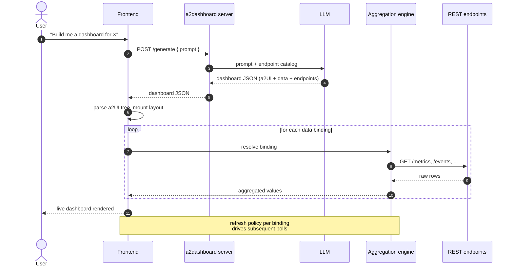
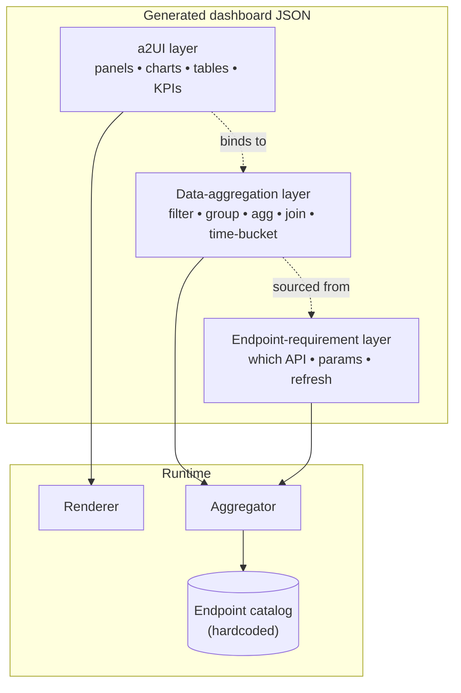

# a2dashboard

> Generic agentic dashboard server. Plug in any REST API, prompt an LLM, get a live declarative-JSON dashboard rendered as native UI. Adds data-binding and refresh primitives. Domain-agnostic.

## What it does

`a2dashboard` turns a plain-language description into a **working dashboard at runtime**, without anyone writing UI code.

1. The user describes the dashboard they want ("show me daily active users over the last 30 days, plus the top 5 endpoints by error rate").
2. An LLM picks the right endpoints from a hardcoded catalog of REST APIs, decides how the data should be aggregated, and emits a single JSON document.
3. The frontend interprets that JSON as a UI tree, fetches and aggregates the referenced data, and renders the live dashboard immediately.

No code generation, no build step, no deploy. The JSON *is* the dashboard.

## The JSON format

The generated document is layered, so each concern stays separable and the LLM can be steered one piece at a time:

- **a2UI** — a declarative UI tree (panels, charts, tables, KPIs, layout). Renderer-agnostic.
- **Data-aggregation extension** — bindings that describe *how* fields are derived from endpoint responses (filter, group, aggregate, join, time-bucket).
- **Endpoint-requirement extension** — for every binding, which endpoint(s) it depends on, query parameters, and refresh policy.

```jsonc
{
  "ui": { /* a2UI tree: panels, charts, tables, KPIs */ },
  "data": { /* aggregations: filter / group / agg / join */ },
  "endpoints": { /* which REST APIs feed which bindings */ }
}
```

Because the data and endpoint layers are extensions on top of a2UI, the same UI tree can be re-pointed at different data sources without touching the layout.

## High-level architecture


## Runtime sequence

What happens when a user submits a prompt:



## Spec layers in one picture

How the three layers of the JSON spec relate to what the user sees:



## Why declarative JSON, not generated code?

- **Safe** — no arbitrary code is shipped to the browser; the renderer only executes a fixed vocabulary of UI and aggregation primitives.
- **Iterable** — the user can refine the dashboard ("make the chart stacked", "add a 7-day moving average") and the LLM patches the JSON instead of rewriting an app.
- **Portable** — the same JSON can be rendered by any client that implements a2UI; the server doesn't care which.
- **Inspectable** — every panel is traceable back to an endpoint, a query, and an aggregation.

## MVP scope

The current implementation is deliberately narrow — just enough surface area to validate the three-layer model end-to-end. Everything else (charts, KPIs, aggregations, more endpoints, alternative renderers) lands as a named extension to this MVP, not by quietly widening it.

- **UI:** `table` for data plus `row` / `column` / `list` layout containers for composing several tables in one dashboard, rendered with React + MUI. Layout containers borrow their `justify` / `align` / `direction` vocabulary from Google's a2ui basic catalog.
- **Aggregation:** none — bindings map endpoint response rows directly to table columns.
- **Endpoint catalog:** two GitHub REST API endpoints (`https://api.github.com`). Unauthenticated for public data (60 req/hour) or authenticated with a GitHub Personal Access Token via `Authorization: Bearer <token>` (5000 req/hour):
  - `GET /users/{username}/repos` — paginated list of a user's public repositories (`type`, `sort`, `direction`, `page`, `per_page`).
  - `GET /repos/{owner}/{repo}/issues` — paginated list of issues for a repository (`state`, `labels`, `sort`, `direction`, `since`, `page`, `per_page`).

In practice, an MVP dashboard JSON looks like a `table` UI node whose columns are bound to fields from one of those two endpoints, with pagination as the only data-side behavior.

## Milestones

`a2dashboard` is built up one tagged milestone at a time. Each tag is a self-contained slice of the three-layer model (UI + aggregation + endpoint) — narrow on purpose, so the loop can be exercised end-to-end before the surface area widens.

| Version | Date | Theme | Highlights |
|---|---|---|---|
| **[v0.0.1](https://github.com/frb-eng/a2dashboard/releases/tag/v0.0.1)** | 2026-05-18 | Conversational, multi-session iteration | Chat-based iteration that patches (not rewrites) the spec, preserving ids · multiple parallel dashboards switchable from a sidebar, persisted to `localStorage` · assistant can reply textually when a request is ambiguous or needs primitives/endpoints that don't exist yet |

### What v0.0.1 delivers

A user can describe a dashboard in plain language and get a live table populated from GitHub's REST API — no code generation, no build step, no deploy — then iterate on it turn-by-turn and keep several dashboards going in parallel.

- Declarative JSON spec (a2UI tree + data bindings + endpoint requirements) generated by `gpt-5-mini` with strict structured outputs.
- React + MUI renderer that interprets the spec at runtime. MVP primitive: `table`. Two GitHub endpoints (`/users/{u}/repos`, `/repos/{o}/{r}/issues`) with pagination params and manual / on-mount refresh.
- Multi-turn chat that patches the existing JSON rather than rewriting it; ui node, column, and binding ids are preserved across turns so the user's mental model survives iteration.
- Multiple parallel dashboard sessions, each with its own conversation, switchable from a left sidebar and persisted to `localStorage`.
- Graceful textual replies when a request is ambiguous, off-topic, or needs primitives or endpoints not yet supported — instead of inventing capabilities to "make it work".

## Status

Early prototype. The endpoint catalog is currently hardcoded — a future iteration will let users register their own REST APIs (OpenAPI ingest) so the catalog becomes per-tenant.
